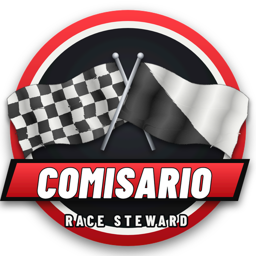
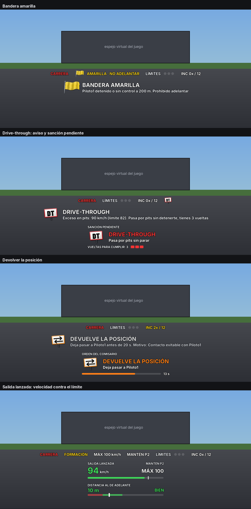
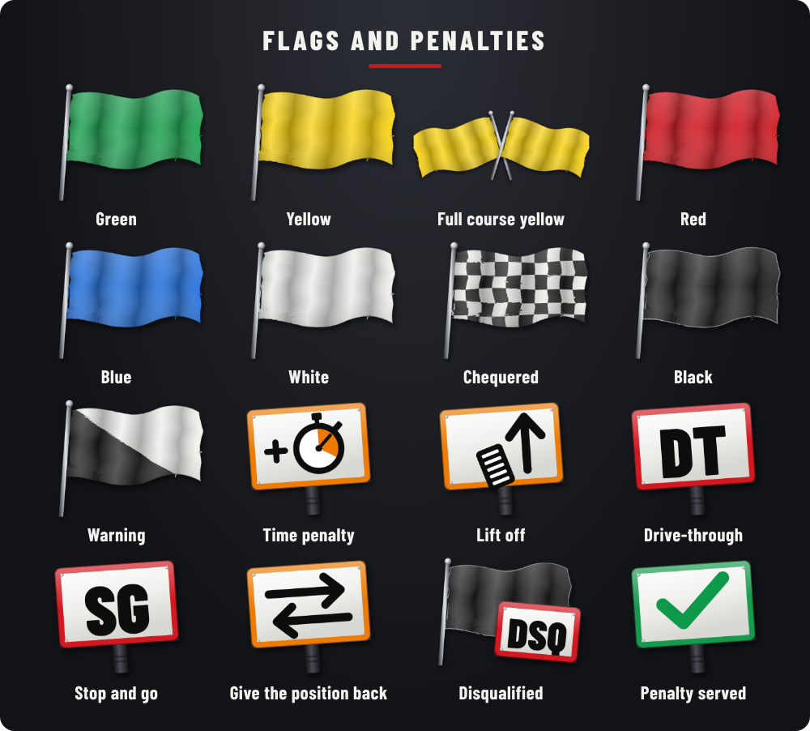

<p align="center"></p>

# Comisario

A race steward for **Assetto Corsa**. It watches track limits, contact, flags and penalties, offline and online, in the style of Real Penalty. Free and open source.

**[Versión en español](README.md)**



## Contents

1. [What you need](#what-you-need)
2. [Install the app](#install-the-app) (everyone does this)
3. [Racing offline](#case-1-racing-offline)
4. [Joining a server that uses Comisario](#case-2-joining-a-server-that-uses-comisario)
5. [Creating your own server with Comisario](#case-3-creating-your-own-server-with-comisario)
6. [App settings](#app-settings)
7. [FAQ](#faq)
8. [What it does](#what-it-does) and [known limits](#project-status-and-known-limits)

---

## What you need

- Assetto Corsa on PC.
- [Content Manager](https://acstuff.club/app/).
- Custom Shaders Patch (installed from Content Manager: Settings > Custom Shaders Patch). Tested with version 0.2.11.

---

## Install the app

Every driver does this, once.

1. Download the **`Comisario-x.x.x.zip`** file of the latest version from [Releases](https://github.com/matipriv768-blip/Comisario/releases/latest). Do not unzip it.
2. Drag the zip onto the Content Manager window.
3. Press the three-lines icon (top right) and then **Install**.
4. Join any session. Move the mouse to the right edge of the screen to show the apps bar, and open **Comisario**.
5. Press the gear icon on the Comisario window to open the settings. Pick **English** at the top.

Manual install, if step 2 does not work: open the zip and copy the `apps` folder into the game folder (`...\steamapps\common\assettocorsa`).

To **update**, repeat steps 1 to 3 with the new zip. Your settings are kept.

---

## Case 1: racing offline

Nothing else is needed besides the app.

1. Set up the race in Content Manager (Drive > Quick Drive or Race), with or without AI, and join.
2. Open the **Comisario** window. It is already watching.
3. In the gear menu, **Start** tab, choose a **Standing** or **Rolling** start.

While Comisario is on, the app turns off the game's own track-cut penalties so they do not add up with its own, and restores them when you turn it off. If the log says the game did not allow it, untick penalties in Content Manager before joining.

Two things need the track to be authorised, because Assetto Corsa does not let an app move cars or control the AI without permission:

- The **short rolling start** (cars line up near the finish line).
- **AI serving penalties on track** (lifting off or pitting). Without it, the AI gets time added in the results.

To authorise it: gear > **More** tab > **Allow on this track**. Then leave the session and join again. The app keeps a copy of the track's original file.

> **Important:** before racing online on that track, go back to gear > More and press **Undo the change on this track**. With the changed file, servers may reject you.

---

## Case 2: joining a server that uses Comisario

1. Install the app (see [Install the app](#install-the-app)).
2. Join the server from Content Manager (Online tab) as usual.
3. Open the **Comisario** window and keep **Comisario on** ticked.

That is all. The server sends its part automatically and the rules are set by the server administrator: you do not configure anything or need any key.

**How to check it works:** when you join, a "COMISARIO SERVER" (or "COMISARIO SERVIDOR") message with a version number shows up at the top, and the Comisario window says "linked to the server script".

**Without the app**, if the server requires it, your car cannot go over 60 km/h until you open it.

---

## Case 3: creating your own server with Comisario

This is for whoever sets up the server in Content Manager. Drivers joining it follow case 2.

### Step 1: install the app

Same as everyone ([Install the app](#install-the-app)).

### Step 2: get the address of the server script

The server does not send files from your PC: it downloads them from the internet. The tested way is to upload the script to a GitHub *gist* (free):

1. Download [`comisario_servidor.lua`](servidor/comisario_servidor.lua) (download button at the top right of the file).
2. Go to <https://gist.github.com> with your GitHub account.
3. In *Filename including extension* type `comisario_servidor.lua`.
4. Open the file with Notepad, copy everything and paste it into the big box.
5. Press **Create secret gist**.
6. Press **Raw** and copy the address from the browser. It looks like this:
   `https://gist.githubusercontent.com/YOUR_USER/CODE/raw/A_LONG_CODE/comisario_servidor.lua`
7. Delete the long code after `/raw/`. It must end up like this:
   `https://gist.githubusercontent.com/YOUR_USER/CODE/raw/comisario_servidor.lua`
   That way the address always serves the latest version you save in the gist.

### Step 3: paste the block into your server

1. In Content Manager go to **Server** and open your preset (or create one).
2. On the **MAIN** tab, find the **Custom Shaders Patch** section and tick **Require CSP to join**.
3. Press **Extra options** and paste this block:

```
[SCRIPT_...]
SCRIPT = 'PASTE_THE_ADDRESS_FROM_STEP_2_HERE'
rollingStart = 1
formationSpeed = 100
greenMeters = 100
startMeters = 500
adminPass = 'yourkey'
requireApp = 1
language = 'en'
```

4. Change two things:
   - In `SCRIPT`, put the address from step 2, **between single quotes**.
   - In `adminPass`, replace `yourkey` with **your own key** (no spaces or accents). Do not share it with the other drivers.

> The block is saved in that preset. **If you create another preset, you have to paste it again.**

### Step 4: adjust the game rules

On the preset's **RULES** tab:

- **Allowed tyres out**: set it to **4**, so the game does not add its own track limits penalty on top of Comisario's.
- **Jump start**: leave it on **car locked** (locked until the start). With the short rolling start, cars are moved into line during the countdown, and the other options are not tested.

Save the preset and start the server.

### Step 5: become the administrator

1. Join your own server.
2. In the app: gear > **Home** tab > **Administrator key**, and type the same key you set in `adminPass`.
3. The Comisario window should say "you are the administrator".

From then on, the rules, start type and flags you choose in your app apply to every driver on the server.

### What each line of the block does

| Line | What it does |
|---|---|
| `SCRIPT` | Web address of the script (step 2). |
| `rollingStart = 1` | Rolling start. `0` = standing start. With the app, the administrator's choice wins. |
| `formationSpeed = 100` | Top speed before the green flag, in km/h. |
| `greenMeters = 100` | The green comes out when the leader is this many metres from the line. |
| `startMeters = 500` | Short start: the leader starts this many metres before the line, the rest in line behind. With `0`, a full formation lap is done (add one lap to the race, because the game counts it). |
| `adminPass = 'yourkey'` | Administrator key. Without this line there is no administrator and each driver uses their own rules. |
| `requireApp = 1` | Drivers without the app cannot go over 60 km/h. Delete it to not require the app. |
| `language = 'en'` | The server's messages are shown in English. Delete it for Spanish. |
| `twoWide = 0` | Optional: short start in a single line. Without it, cars start two by two (1 and 2 side by side, 2 a few metres back). If the track has no room for two cars there, it uses a single line anyway. |
| `lockStart = 1` | Optional: the start type is set by the server and cannot be changed from the app. |

### Updating the server script

Go to your gist, press **Edit**, replace the whole content with the new file and press **Update**. If you did point 7 of step 2, you do not need to touch Content Manager: just restart the server. When you join, the "COMISARIO SERVER" message should show the new version.

---

## App settings

The gear icon on the Comisario window opens the settings:

- At the top: language, **Comisario on** and **Show all options** (unticked, only the main options are shown).
- Tabs: **Home** (rules summary and administrator key), **Start**, **Track** (limits and pits), **Contacts**, **Penalties** (durations and incident points), **Flags**, **Display** (indicator size and position) and **More** (AI, log and test buttons).
- Where there is a **(?)**, the explanation shows up when you hover over it.

*The images on this page are drawings made with the test simulator, not in-game screenshots.*

---

## FAQ

**Do the other drivers need to install anything?**
Yes, the app (case 2). The server script reaches them automatically.

**Does it work without the server script?**
Yes. The app still warns and penalises. Without the script it cannot hold the car's speed on the formation lap, move it into line for the short start or send a disqualified driver to the pits.

**I found a bug.**
Report it in the [Issues](https://github.com/matipriv768-blip/Comisario/issues) tab. Attaching `Documents\Assetto Corsa\logs\comisario_log.txt` and, if you can, a short video helps a lot.

---

## What it does

- **Track limits**: every off, or only cuts with an advantage (if you lift and lose speed, it does not count).
- **Contact** graded by speed difference: light touch, contact and heavy crash, with the car hitting from behind at fault.
- **Incident points** in the iRacing style, with a configurable maximum and disqualification above it.
- **Penalties**: time, lift off, drive-through, stop and go and disqualification, with a deadline in laps.
- **Giving the position back** after contact, an off-track overtake or an overtake under yellow.
- **Flags**: green, yellow, blue, white, chequered and black, plus full course yellow and red called by race control.
- **Standing or rolling start**, with a full or short formation lap, in one or two rows, a speed readout against the limit, a gap radar to the car ahead and green lights.
- **Sessions**: practice only counts, qualifying only invalidates the lap, races penalise.
- **AI** is watched too and serves penalties on track, if the track allows it (not yet tested in game).
- **Online**: each driver is watched by their own app and the apps report to each other. The administrator sets the rules and flags for the whole server.
- **Winner with penalties applied** when the race ends.
- **Spanish and English**.



## Project status and known limits

- Tested in game by its author: offline against the AI at Spa (short rolling start in one and two rows, with up to 14 cars) and on a private server with one or two drivers (penalties, short rolling start, sending a disqualified driver to the pits, administrator, fixed interface and icons). Not tested on public servers or with large online grids. The online two-row start (script 1.12) and the formation radar are not tested in game yet.
- The AI serving penalties on track, flags with several cars and the winner announcement are only verified with the test simulator in this repository. Reports are welcome.
- Disqualification does not kick anyone from the server or change the game's own results table.
- Everything runs on each driver's PC: the administrator key stops a regular driver, not someone who edits their own copy of the app.
- Online, drivers without the app are not watched.
- No pit exit line, DRS or safety car.

---

## For developers

The logic is tested outside the game with a simulator of the CSP API (`test/harness.lua`). You need Python 3 and the `lupa` package:

```
pip install lupa
python3 test/check_i18n.py apps/lua/Comisario/Comisario.lua
python3 test/run_tests.py apps/lua/Comisario/Comisario.lua
python3 test/run_online.py apps/lua/Comisario/Comisario.lua
python3 test/run_server.py servidor/comisario_servidor.lua
```

Texts are written in Spanish inside `tr('...')`; the English table `EN` is at the end of `Comisario.lua`. Adding a language means adding one more table like it. See [CONTRIBUTING.md](CONTRIBUTING.md) (Spanish).

## Credits

Created by Matías ([matipriv768-blip](https://github.com/matipriv768-blip)). The code, icons and logo were made with assistance from Claude, by Anthropic, drawn as SVG (`arte/generar_iconos.py`). The logo typeface is Barlow Condensed by Jeremy Tribby, under the SIL Open Font License.

Comisario is an independent project. It is not affiliated with Real Penalty, iRacing, the FIA, Kunos Simulazioni or the authors of Custom Shaders Patch or Content Manager, and uses no code or files from those projects.

## License

[MIT](LICENSE).
