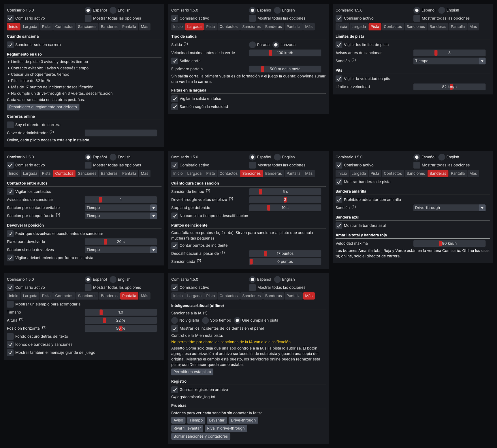
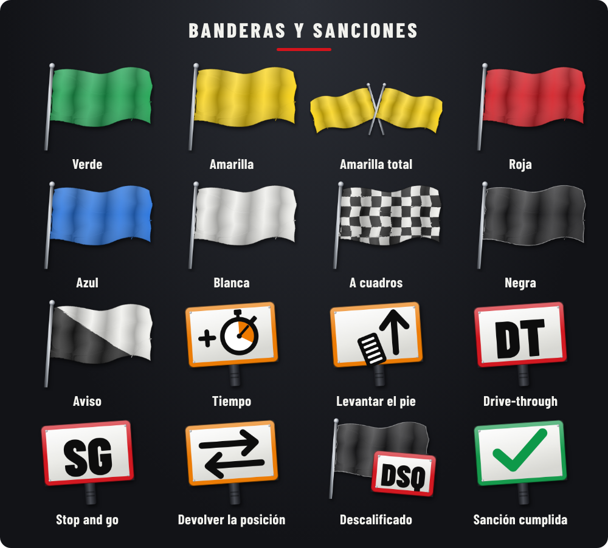

<p align="center"></p>

# Comisario

Comisario de carrera para **Assetto Corsa**. Vigila límites de pista, contactos, banderas y sanciones, offline y online, al estilo de Real Penalty. Es gratis y de código abierto.

**[English version](README.en.md)**


## Contenido

1. [Qué necesitas](#qué-necesitas)
2. [Instalar la app](#instalar-la-app) (todos tienen que hacer esto)
3. [Correr offline](#caso-1-correr-offline)
4. [Entrar a un servidor que usa Comisario](#caso-2-entrar-a-un-servidor-que-usa-comisario)
5. [Crear tu propio servidor con Comisario](#caso-3-crear-tu-propio-servidor-con-comisario)
6. [Ajustes de la app](#ajustes-de-la-app)
7. [Preguntas frecuentes](#preguntas-frecuentes)
8. [Qué hace](#qué-hace) y [límites conocidos](#estado-del-proyecto-y-límites-conocidos)

---

## Qué necesitas

- Assetto Corsa en PC.
- [Content Manager](https://acstuff.club/app/).
- Custom Shaders Patch (se instala desde Content Manager: Settings > Custom Shaders Patch). Probado con la versión 0.2.11.

---

## Instalar la app

Esto lo hace cada piloto, una sola vez.

1. Descarga el archivo **`Comisario-x.x.x.zip`** de la última versión, en [Releases](https://github.com/matipriv768-blip/Comisario/releases/latest). No lo descomprimas.
2. Arrastra el zip a la ventana de Content Manager.
3. Pulsa el ícono de las tres rayas (arriba a la derecha) y luego **Install**.
4. Entra a cualquier sesión. Lleva el mouse al borde derecho de la pantalla: aparece la barra de apps. Abre **Comisario**.
5. Pulsa el engranaje de la ventana Comisario para abrir los ajustes. Arriba eliges el idioma (Español o English).

Instalación manual, si el paso 2 no funciona: abre el zip y copia la carpeta `apps` dentro de la carpeta del juego (`...\steamapps\common\assettocorsa`).

Para **actualizar**, repite los pasos 1 a 3 con el zip nuevo. Tus ajustes se conservan.

---

## Caso 1: correr offline

No hace falta nada más que la app instalada.

1. Arma la carrera en Content Manager (Drive > Quick Drive o Race), con o sin IA, y entra.
2. Abre la ventana **Comisario**. Ya está vigilando.
3. En el engranaje, pestaña **Largada**, elige salida **Parada** o **Lanzada**.

Mientras el Comisario está activo, la app apaga las sanciones propias del juego por cortar pista, para que no se sumen a las suyas, y las deja como estaban al apagarlo. Si el registro dice que el juego no la dejó, desmarca las penalizaciones en Content Manager antes de entrar.

Dos cosas requieren autorizar la pista, porque Assetto Corsa no deja que una app mueva autos ni controle a la IA sin permiso:

- La **salida lanzada corta** (los autos parten en fila cerca de la meta).
- Que la **IA cumpla sus sanciones en pista** (que levante el pie o entre a pits). Sin autorización, a la IA se le suma tiempo en la clasificación.

Para autorizarla: engranaje > pestaña **Más** > **Permitir en esta pista**. Después sal de la sesión y vuelve a entrar. La app guarda una copia del archivo original de la pista.

> **Importante:** antes de correr online en esa pista, vuelve a engranaje > Más y pulsa **Deshacer el cambio en esta pista**. Con el archivo cambiado, los servidores pueden rechazarte.

---

## Caso 2: entrar a un servidor que usa Comisario

1. Instala la app (sección [Instalar la app](#instalar-la-app)).
2. Entra al servidor desde Content Manager (pestaña Online), como siempre.
3. Abre la ventana **Comisario** y deja marcado **Comisario activo**.

Eso es todo. El servidor te envía su parte automáticamente y las reglas las pone el administrador del servidor: tú no configuras nada ni necesitas ninguna clave.

**Cómo saber que funciona:** al entrar aparece arriba el mensaje "COMISARIO SERVIDOR" con un número de versión, y la ventana Comisario dice "enlazado con el script del servidor".

**Si no tienes la app** y el servidor la exige, tu auto no pasa de 60 km/h hasta que la abras.

---

## Caso 3: crear tu propio servidor con Comisario

Este caso es para quien arma el servidor en Content Manager. Los pilotos que entren hacen el caso 2.

### Paso 1: instala la app

Igual que todos ([Instalar la app](#instalar-la-app)).

### Paso 2: consigue la dirección del script del servidor

El servidor no envía archivos desde tu PC: los descarga de internet. La forma probada es subir el script a un *gist* de GitHub (es gratis):

1. Descarga [`comisario_servidor.lua`](servidor/comisario_servidor.lua) (botón de descarga arriba a la derecha del archivo).
2. Entra a <https://gist.github.com> con tu cuenta de GitHub.
3. En *Filename including extension* escribe `comisario_servidor.lua`.
4. Abre el archivo con el Bloc de notas, copia todo y pégalo en el cuadro grande.
5. Pulsa **Create secret gist**.
6. Pulsa el botón **Raw** y copia la dirección del navegador. Se ve así:
   `https://gist.githubusercontent.com/TU_USUARIO/CODIGO/raw/UN_CODIGO_LARGO/comisario_servidor.lua`
7. Borra el código largo que va después de `/raw/`. Debe quedar así:
   `https://gist.githubusercontent.com/TU_USUARIO/CODIGO/raw/comisario_servidor.lua`
   Así la dirección siempre entrega la última versión que guardes en el gist.

### Paso 3: pega el bloque en tu servidor

1. En Content Manager entra a **Server** y abre tu preset (o crea uno).
2. En la pestaña **MAIN**, busca la sección **Custom Shaders Patch** y marca **Require CSP to join**.
3. Pulsa **Extra options** y pega este bloque:

```
[SCRIPT_...]
SCRIPT = 'PEGA_AQUI_LA_DIRECCION_DEL_PASO_2'
rollingStart = 1
formationSpeed = 100
greenMeters = 100
startMeters = 500
adminPass = 'tuclave'
requireApp = 1
```

4. Cambia dos cosas:
   - En `SCRIPT`, pon la dirección del paso 2, **entre comillas simples**.
   - En `adminPass`, cambia `tuclave` por **tu propia clave** (sin tildes ni espacios). No se la des a los demás pilotos.

> El bloque se guarda en ese preset. **Si creas otro preset, tienes que pegarlo de nuevo.**

### Paso 4: ajusta las reglas del juego

En la pestaña **RULES** del preset:

- **Allowed tyres out**: ponlo en **4**, para que el juego no ponga su propia sanción por límites de pista encima de la de Comisario.
- **Jump start** (salida en falso): déjalo en **car locked** (auto bloqueado hasta la largada). Con la salida lanzada corta los autos se mueven a la fila durante la cuenta regresiva, y con las otras opciones no está probado.

Guarda el preset y arranca el servidor.

### Paso 5: hazte administrador

1. Entra a tu propio servidor.
2. Abre la app: engranaje > pestaña **Inicio** > **Clave de administrador**, y escribe la misma clave que pusiste en `adminPass`.
3. La ventana Comisario debe decir "eres el administrador".

Desde ahí, el reglamento, el tipo de salida y las banderas que elijas en tu app valen para todos los pilotos del servidor.

### Qué significa cada línea del bloque

| Línea | Qué hace |
|---|---|
| `SCRIPT` | Dirección web del script (paso 2). |
| `rollingStart = 1` | Salida lanzada. `0` = salida parada. Con la app, manda lo que elija el administrador. |
| `formationSpeed = 100` | Velocidad máxima antes de la bandera verde, en km/h. |
| `greenMeters = 100` | La verde sale cuando al primero le faltan estos metros para la meta. |
| `startMeters = 500` | Salida corta: el primero parte a estos metros de la meta, el resto en fila detrás. Con `0` se da la vuelta de formación completa (en ese caso suma una vuelta a la carrera, porque el juego la cuenta). |
| `adminPass = 'tuclave'` | Clave de administrador. Si borras la línea, no hay administrador y cada piloto usa sus propias reglas. |
| `requireApp = 1` | Quien entre sin la app no pasa de 60 km/h. Bórrala si no quieres exigirla. |
| `language = 'en'` | Opcional: los mensajes del servidor salen en inglés. |
| `twoWide = 0` | Opcional: la salida corta en una sola fila. Sin la línea, va en dos filas (1 y 2 lado a lado, el 2 unos metros detrás). Si la pista no da para dos autos en esa zona, va en una sola fila igual. |
| `lockStart = 1` | Opcional: el tipo de salida lo fija el servidor y no se puede cambiar desde la app. |

### Actualizar el script del servidor

Entra a tu gist, pulsa **Edit**, reemplaza todo el contenido por el archivo nuevo y pulsa **Update**. Si hiciste el punto 7 del paso 2, no tienes que tocar Content Manager: solo reinicia el servidor. Al entrar, el mensaje "COMISARIO SERVIDOR" debe mostrar la versión nueva.

Más detalles en [`servidor/INSTRUCCIONES_SERVIDOR.txt`](servidor/INSTRUCCIONES_SERVIDOR.txt).

---

## Ajustes de la app

El engranaje de la ventana Comisario abre los ajustes:

- Arriba: idioma, **Comisario activo** y **Mostrar todas las opciones** (sin marcar se ven solo las principales).
- Pestañas: **Inicio** (resumen del reglamento y clave de administrador), **Largada**, **Pista** (límites y pits), **Contactos**, **Sanciones** (duraciones y puntos de incidente), **Banderas**, **Pantalla** (tamaño y lugar de los indicadores) y **Más** (IA, registro y botones de prueba).
- Donde hay un **(?)**, la explicación aparece al pasar el mouse por encima.



*Las imágenes de esta página son dibujos hechos con el simulador de pruebas, no capturas del juego.*

---

## Preguntas frecuentes

**¿Los demás pilotos tienen que instalar algo?**
Sí, la app (caso 2). El script del servidor les llega solo.

**¿Funciona sin el script del servidor?**
Sí. La app igual avisa y sanciona. Lo que no puede hacer sin el script es frenar el auto en la formación, moverlo a la fila en la salida corta ni mandar a pits a un descalificado.

**¿Se puede ver la guía completa?**
Está en [`apps/lua/Comisario/LEEME.txt`](apps/lua/Comisario/LEEME.txt) y viene dentro del zip.

**Encontré un error.**
Repórtalo en la pestaña [Issues](https://github.com/matipriv768-blip/Comisario/issues). Ayuda mucho adjuntar el archivo `Documentos\Assetto Corsa\logs\comisario_log.txt` y, si puedes, un video corto.

---

## Qué hace

- **Límites de pista**: toda salida, o solo el atajo con ventaja (si sueltas y pierdes velocidad, no cuenta).
- **Contactos** graduados por diferencia de velocidad: roce, contacto y choque fuerte, con culpa para quien alcanza por detrás.
- **Puntos de incidente** al estilo iRacing, con máximo configurable y descalificación al pasarlo.
- **Sanciones**: tiempo, levantar el pie, drive-through, stop and go y descalificación, con plazo en vueltas.
- **Devolver la posición** tras un contacto, un adelantamiento por fuera de la pista o con bandera amarilla.
- **Banderas**: verde, amarilla, azul, blanca, a cuadros y negra, más amarilla total y roja decretadas por la dirección de carrera.
- **Salida parada o lanzada**, con vuelta de formación completa o corta, en una o dos filas, velocímetro contra el límite, radar de distancia al auto de adelante y semáforo verde.
- **Sesiones**: en práctica solo cuenta, en clasificación solo invalida la vuelta, en carrera sanciona.
- **IA**: también es vigilada y cumple en pista, si la pista lo permite (sin probar todavía en el juego).
- **Online**: cada piloto es vigilado por su propia app y todas se avisan entre sí. El administrador impone su reglamento y las banderas a todo el servidor.
- **Ganador con las sanciones aplicadas** al terminar la carrera.
- **Español e inglés**.



## Estado del proyecto y límites conocidos

- Probado en el juego por su autor: offline contra la IA en Spa (salida lanzada corta en una y dos filas, con hasta 14 autos) y en un servidor propio con uno o dos pilotos (sanciones, salida lanzada corta, envío a pits del descalificado, administrador, interfaz fija e íconos). No se ha probado en servidores públicos ni con grillas grandes online. La fila doble online (script 1.12) y el radar de la formación aún no se prueban en el juego.
- Las sanciones que cumple la IA en pista, las banderas con varios autos y el aviso de ganador solo están verificados con el simulador de pruebas de este repositorio. Si lo pruebas, se agradece el reporte.
- La descalificación no expulsa a nadie del servidor ni cambia la tabla de resultados del juego.
- Todo corre en el PC de cada piloto: la clave de administrador frena a un piloto común, no a alguien que modifique su copia de la app.
- Online, quien no tenga la app no es vigilado.
- No incluye cruce de la línea de salida de pits, DRS ni coche de seguridad.

---

## Para desarrolladores

| Carpeta | Contenido |
|---|---|
| `apps/lua/Comisario/` | La app: `Comisario.lua`, el manifiesto, la guía `LEEME.txt` y los íconos (`img/`). Es lo que se instala. |
| `servidor/` | Script online para el servidor y sus instrucciones. |
| `test/` | Simulador de la API de CSP y las pruebas. |
| `arte/` | Scripts que dibujan los íconos, el logo y la lámina de señales (SVG renderizado con Playwright; la letra Barlow Condensed se instala con `npm install @fontsource/barlow-condensed`). |
| `docs/` | Imágenes de esta página. |

La lógica se prueba fuera del juego con un simulador de la API de CSP (`test/harness.lua`). Se necesita Python 3 y el paquete `lupa`:

```
pip install lupa
python3 test/check_i18n.py apps/lua/Comisario/Comisario.lua
python3 test/run_tests.py apps/lua/Comisario/Comisario.lua
python3 test/run_online.py apps/lua/Comisario/Comisario.lua
python3 test/run_server.py servidor/comisario_servidor.lua
```

Ver [CONTRIBUTING.md](CONTRIBUTING.md) para proponer cambios y [CHANGELOG.md](CHANGELOG.md) para el historial de versiones.

## Créditos

Creado por Matías ([matipriv768-blip](https://github.com/matipriv768-blip)). El código, los íconos y el logo se hicieron con asistencia de Claude, de Anthropic, dibujados en SVG (`arte/generar_iconos.py`). La letra del logo es Barlow Condensed, de Jeremy Tribby, con licencia SIL Open Font License.

Comisario es un proyecto independiente. No está afiliado a Real Penalty, iRacing, la FIA, Kunos Simulazioni ni a los autores de Custom Shaders Patch o Content Manager, y no usa código ni archivos de esos proyectos. Algunas reglas (atajo con ventaja, escala de sanciones por velocidad) usan los mismos valores públicos de configuración de Real Penalty.

## Licencia

[MIT](LICENSE). Puedes usarlo, modificarlo y redistribuirlo, manteniendo el aviso de autoría.
